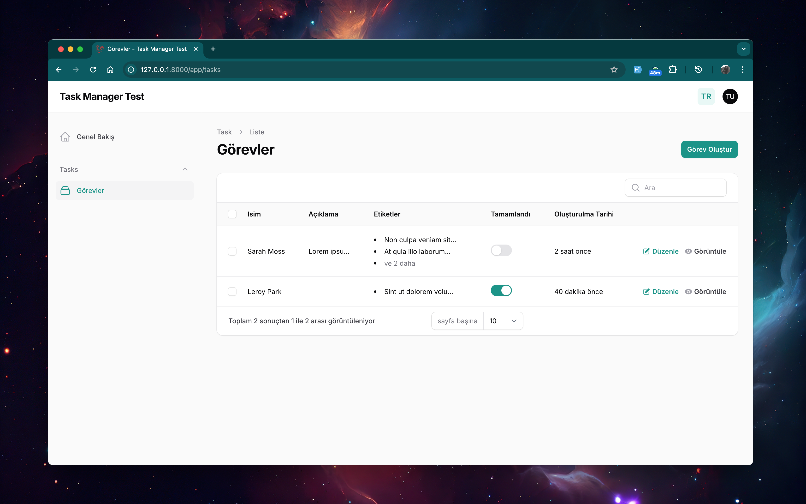

## Task Management System - Test

### Author: Namu Makwembo  



## Quick Start

1. Clone the repository:
   ```sh
   git clone https://github.com/namumakwembo/task-manager-test.git
   cd task-manager-test
   ```
2. Install dependencies:
   ```sh
   composer install
   npm install
   ```
3. Set up environment variables:
   ```sh
   cp .env.example .env
   ```
4. Set up database:
   ```sh
   touch database/database.sqlite   
   php artisan migrate --seed
   php artisan key:generate
   php artisan optimize
   ```
5. Start the development server:
   ```sh
   composer dev
   ```
6. Run tests:
   ```sh
   php artisan test
   ```
7. Visit the application:
   [http://127.0.0.1:8000/](http://127.0.0.1:8000/)

### Default Login Credentials
  - **Email:** test@example.com  
  - **Password:** password

---

## **Yeni API Entegrasyonu**  
Değerlendirme sürecinin bir parçası olarak projeye API işlevselliği eklendi.  

### En son güncellemeleri almak için:  
1. En son değişiklikleri çekin:  
   ```sh
   git pull origin main
   ```  

2. Yeni API entegrasyonunu test etmek için:  
   ```sh
   php artisan test
   ``` 
    

### **API Enhancements**
1. **Sanctum Authentication**
   - Installed Laravel Sanctum to handle authentication tokens.
   - Secured API routes using Sanctum middleware.

2. **API Routes & Versioning**
   - All API endpoints are structured under `api/v1/` for versioning.
   - API Routes:
     ```
     GET    api/v1/tasks              -> tasks.index  (List all tasks)
     POST   api/v1/tasks              -> tasks.store  (Create a new task)
     GET    api/v1/tasks/{task}       -> tasks.show   (View a specific task)
     PUT    api/v1/tasks/{task}       -> tasks.update (Update a task)
     DELETE api/v1/tasks/{task}       -> tasks.destroy (Delete a task)
     ```
   - Created `Api/V1/TaskController.php` to manage task-related API requests.
   - Implemented API authentication endpoints:
     ```
     POST api/v1/tokens/create  (Generate API tokens)
     GET  api/v1/user           (Fetch authenticated user details)
     ```

3. **Task Resource & Validation**
   - Created `Api/V1/Resources/TaskResource.php` to efficiently handle API responses.
   - Created `Api/V1/Requests/TaskRequest.php` to consolidate validation logic for API requests.

4. **Automated Testing (PestPHP)**
   - Wrote tests for CRUD operations using PestPHP.
   - Covered:
     - Validation Tests
     - Action Testing (Creating, Updating, and Deleting Tasks)
     - Data Verification (Ensuring database updates match expected results)

---

### **Folder Structure for API Versioning**
```
app/
 ├── Http/
 │   ├── Controllers/
 │   │   ├── Api/
 │   │   │   ├── V1/
 │   │   │   │   ├── TaskController.php
 │   │   │   │   ├── AuthController.php
 │   ├── Requests/
 │   │   ├── Api/
 │   │   │   ├── V1/
 │   │   │   │   ├── TaskRequest.php
 │   ├── Resources/
 │   │   ├── Api/
 │   │   │   ├── V1/
 │   │   │   │   ├── TaskResource.php
```
This structure ensures scalability and easy management of future API versions.

 
